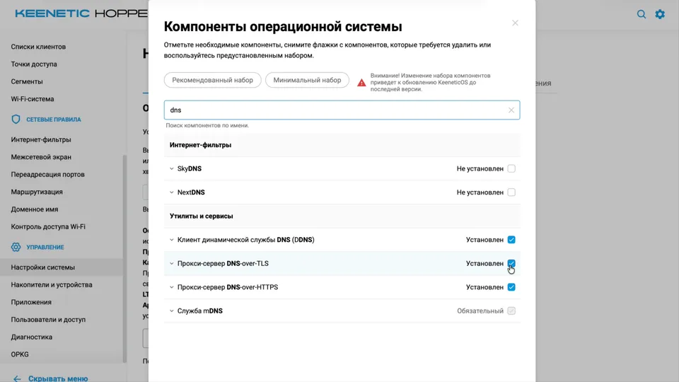
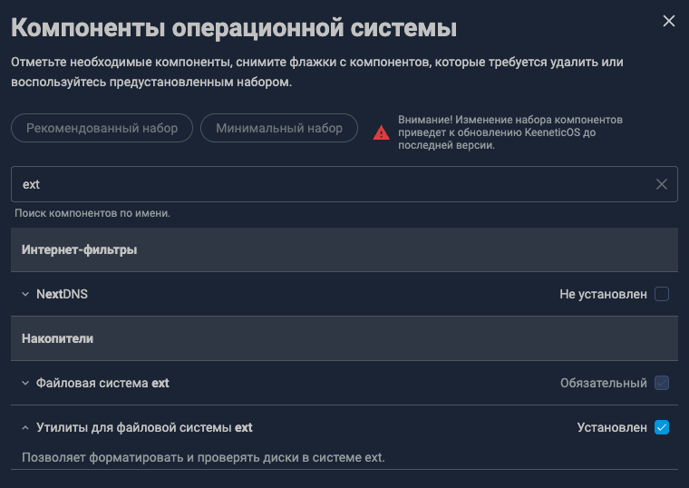
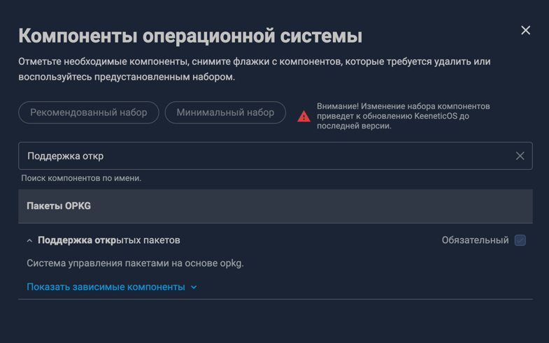
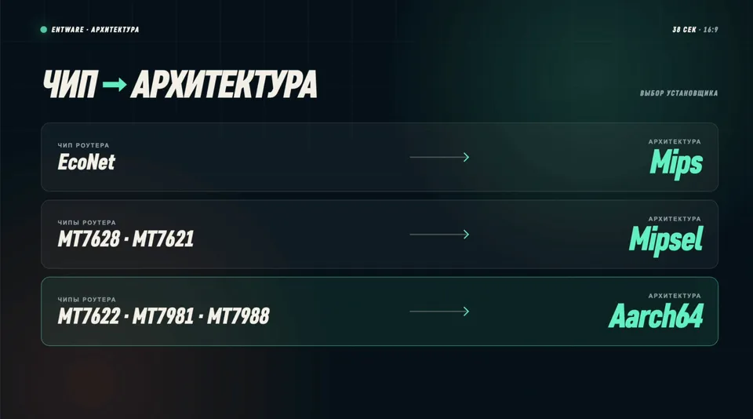
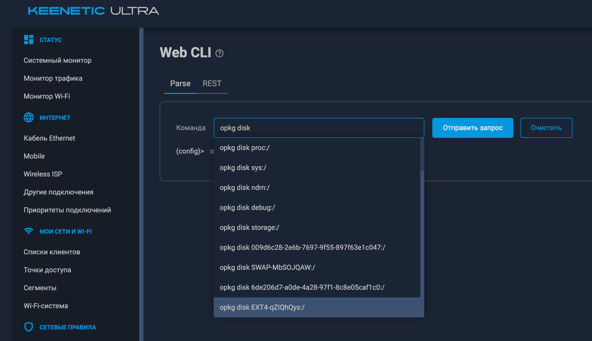
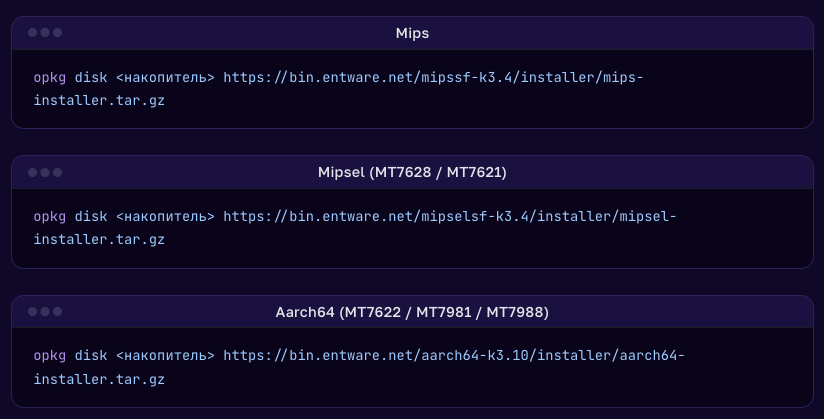
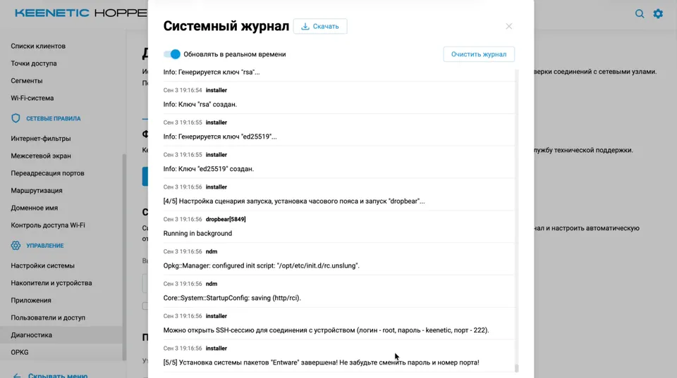

# Private VPN Resilience

Автоматизированное развёртывание и сопровождение устойчивого частного VPN на
Ubuntu VPS и роутере Keenetic с Entware.

Проект содержит:

- скил `private-vpn-resilience` для Codex и совместимых Agent Skills-клиентов;
- агента `private-vpn-bootstrap` для OpenCode;
- проверенные сценарии установки, диагностики, failover и восстановления;
- служебные скрипты для Hysteria2, VLESS Reality, AmneziaWG и HydraRoute;
- пошаговую подготовку Keenetic перед передачей работы агенту.

> [!IMPORTANT]
> Это набор инструкций для агента с root-доступом к VPS и роутеру. Перед
> запуском сделайте резервную копию Keenetic и используйте временные SSH-ключи.
> Убедитесь, что личный VPN разрешён правилами VPS-провайдера и применимым
> законодательством.

## Что будет развёрнуто

Агент создаёт три независимых транспорта:

| Транспорт | Реализация на роутере | Интерфейс Keenetic | Назначение |
| --- | --- | --- | --- |
| Hysteria2 | официальный native-клиент, SOCKS5 `127.0.0.1:1082` | `Proxy0` | основной UDP-путь с обфускацией и сменой портов |
| VLESS Reality | официальный Xray, SOCKS5 `127.0.0.1:1083` | `Proxy1` | резервный TCP/TLS-путь |
| AmneziaWG | AWG Manager, kernel tunnel | `OpkgTun10` | независимый WireGuard-подобный путь |

HydraRoute направляет выбранные домены и сети через политику `HydraRoute` в
порядке `Hysteria2 → VLESS Reality → AmneziaWG`. Прямой выход через провайдера
для этой политики намеренно отключён: при отказе всех трёх транспортов трафик
не должен незаметно уйти в обход VPN.

На VPS агент устанавливает 3x-ui и создаёт ровно три production-inbound. Версии
компонентов определяются во время установки: используются свежие стабильные
релизы из официальных источников, без beta, nightly и release candidate.

Основной автоматизированный сценарий — новый VPS как сервер и Keenetic как
клиент/маршрутизатор. Скил также содержит проверенные процедуры для Keenetic в
роли публичного VPN-сервера и для подключения другого роутера к нему. Это
расширенный режим: перед изменениями агент должен проверить наличие публичного
адреса, доступность входящих TCP/UDP-портов со внешней сети и совместимость
модулей конкретной модели.

## Требования

### Компьютер управления

- установленный Codex или OpenCode;
- доступ по SSH к VPS и локальной сети роутера;
- отдельный ноутбук или телефон в LAN без локального VPN для приёмочного теста;
- при необходимости — отдельный VPN на компьютере управления, чтобы агент не
  потерял доступ к пакетным репозиториям. Это подключение нельзя использовать
  как доказательство работы маршрута через роутер.

### VPS

- чистый или выделенный VPS с публичным IPv4;
- Ubuntu 24.04 LTS — рекомендуемая и проверенная база;
- SSH под `root` или пользователем с полноценным `sudo`;
- рабочие DNS, синхронизация времени и исходящий интернет;
- возможность открыть SSH-порт, порт панели и VPN-порты.

Агент сам установит 3x-ui, создаст inbound-подключения, настроит firewall и
проверит слушающие порты. Заранее устанавливать панель не нужно.

### Роутер

- Keenetic с USB-накопителем и поддержкой OPKG/Entware;
- Entware смонтирован в `/opt` и переживает перезагрузку;
- включён SSH-доступ с пользователем `root`;
- рабочие интернет, DNS, дата и время;
- резервная копия конфигурации Keenetic.

Агент проверит архитектуру, компоненты прошивки, память, место на накопителе и
совместимость модулей AmneziaWG/Netfilter. При несовместимом оборудовании он
остановится до внесения опасных изменений и назовёт блокирующую причину.

## Подготовка Keenetic

Названия пунктов могут немного отличаться между версиями KeeneticOS.

### 1. Подготовьте накопитель

Используйте качественный USB 3.0-накопитель. Металлический корпус лучше отводит
тепло, но проверьте фактическую температуру: постоянный перегрев сокращает срок
службы флеш-памяти.

В веб-интерфейсе откройте **Параметры системы → Изменить набор компонентов** и
добавьте:

- файловую систему Ext;
- утилиты для файловой системы Ext;
- поддержку открытых пакетов (OPKG);
- DNS-over-TLS и DNS-over-HTTPS;
- компоненты WireGuard, Netfilter/Xtables и Ping Check, если они доступны для
  модели. Агент повторно проверит точный состав во время preflight.






Отформатируйте выделенный накопитель в EXT4 средствами Keenetic и убедитесь,
что на нём нет нужных данных: форматирование уничтожит содержимое выбранного
раздела.

### 2. Настройте защищённый DNS

В разделе **Интернет-фильтры → DNS** добавьте серверы типа DNS-over-TLS. Для
базовой конфигурации подойдут `1.1.1.1` и `8.8.8.8`. Если у вас уже настроен
другой доверенный DNS-провайдер, сохраняйте его — эти адреса не являются
обязательными для работы скила.

### 3. Определите архитектуру и установите Entware

Архитектура установщика зависит от чипа роутера.



Откройте CLI Keenetic, начните вводить `opkg disk` и нажмите `Tab`, чтобы выбрать
подключённый накопитель (имя начинается с EXT4). Затем укажите URL установщика для своей архитектуры:



Пример для Aarch64:

```text
opkg disk <накопитель> https://bin.entware.net/aarch64-k3.10/installer/aarch64-installer.tar.gz
```

Не копируйте Aarch64-команду вслепую. Неправильная архитектура не заработает.

Следите за установкой в **Диагностика → Системный журнал**. Дождитесь сообщения
`[5/5] Установка системы пакетов Entware завершена`.



### 4. Проверьте SSH-доступ к Entware

Порт Entware SSH будет указан в системном журнале. Подключитесь с компьютера
управления:

```bash
ssh root@192.168.1.1 -p 222
```

Адрес и порт в примере замените своими. Если установщик выдал стандартный
пароль, немедленно смените его командой `passwd`. После этого проверьте:

```sh
mount | grep ' /opt '
opkg update
```

## Установка скила и агента

Клонируйте репозиторий и выполняйте команды из его корня.

### Codex

Установите скил в каталог Codex:

```bash
mkdir -p "${CODEX_HOME:-$HOME/.codex}/skills"
cp -R skills/private-vpn-resilience "${CODEX_HOME:-$HOME/.codex}/skills/"
```

Перезапустите Codex или откройте новую задачу, чтобы каталог скилов обновился.
Отдельный agent-файл для Codex не требуется: скил сам работает как агент
развёртывания.

### OpenCode

Установите общий скил и основной агент:

```bash
mkdir -p "$HOME/.agents/skills" "$HOME/.config/opencode/agents"
cp -R skills/private-vpn-resilience "$HOME/.agents/skills/"
cp agents/private-vpn-bootstrap.md "$HOME/.config/opencode/agents/"
```

## Запуск

### Codex

Сначала попросите показать предварительные условия. Режим `init` ничего не
меняет и не подключается по SSH:

```text
$private-vpn-resilience init
```

После подготовки запустите установку:

```text
$private-vpn-resilience Разверни VPN с нуля.
```

Для дальнейшей эксплуатации тот же скил можно вызывать обычными задачами:

```text
$private-vpn-resilience Проверь состояние всех трёх транспортов и failover.
$private-vpn-resilience Диагностируй нестабильность Hysteria2, ничего пока не меняй.
$private-vpn-resilience Обнови компоненты до свежих стабильных версий с rollback.
$private-vpn-resilience Восстанови VLESS Reality после сбоя и повтори soak-тест.
$private-vpn-resilience Настрой этот Keenetic как VPN-сервер; сначала выполни только preflight внешней доступности портов.
```

### OpenCode

Запустите основной агент:

```bash
opencode --agent private-vpn-bootstrap
```

Сообщение `init` покажет подготовительный чек-лист без подключения к устройствам.
Когда всё готово, напишите `Начни развёртывание с нуля`.

## Какие данные передать агенту

Агент запросит одним сообщением:

- VPS: IP/hostname, SSH-порт, пользователя с root-доступом и способ
  аутентификации;
- роутер: IP/hostname, SSH-порт, пользователя `root` и способ аутентификации.

Предпочтителен отдельный временный SSH-ключ. Передавайте путь к приватному ключу
на компьютере, а не его содержимое. Если используете временный пароль, не
публикуйте его в общем чате и отзовите после установки.

Агент не должен выводить пароли, приватные ключи, UUID, subscription URI и
другие секреты в отчёт или сохранять их в репозитории. Перед заменой файлов он
создаёт резервные копии, меняет по одному транспорту и предупреждает перед
перезагрузкой роутера или VPS.

## Как проходит развёртывание

1. Read-only preflight: ОС, архитектура, компоненты, `/opt`, ресурсы, порты,
   firewall, DNS и время.
2. Создание rollback anchors и манифеста фактически установленных версий.
3. Установка 3x-ui и трёх production-inbound на VPS.
4. Установка AWG Manager, HydraRoute Neo, официальных Hysteria и Xray на роутер.
5. Создание Keenetic-интерфейсов, Ping Check и политики без ISP fallback.
6. Раздельная проверка каждого транспорта, затем failover и восстановление.
7. Перезапуск в стиле reboot, нагрузочный тест, очистка временных секретов и
   финальный отчёт.

Статус `RUNNING` в интерфейсе не считается доказательством работы. Агент
проверяет реальные HTTP-запросы через каждый интерфейс, счётчики UDP/drop,
нагрузку, 5–30-минутный soak и автоматическое восстановление.

Финальный приёмочный тест выполняется с отдельного устройства в LAN без
локального VPN. Если тест доступен только вам, агент даст короткую точную
инструкцию и продолжит после результата.

## Ограничения

- Поддержка AmneziaWG зависит от модели Keenetic, версии ядра и доступных
  компонентов прошивки.
- Параметры, работающие у одного провайдера, могут вести себя иначе в другой
  сети. Скил сначала собирает измерения и только затем меняет маскировку,
  fingerprint, MTU или интервалы смены портов.
- Ни один набор протоколов не гарантирует устойчивость к будущим изменениям
  фильтрации. Цель проекта — независимые пути, проверяемый failover и
  воспроизводимая диагностика.
- Списки HydraRoute в `assets/HydraRoute/` являются стартовой конфигурацией.
  Перед использованием проверьте, соответствуют ли они вашей политике
  маршрутизации.

## Структура репозитория

```text
.
├── agents/
│   └── private-vpn-bootstrap.md
├── images/
├── skills/
│   └── private-vpn-resilience/
│       ├── SKILL.md
│       ├── agents/openai.yaml
│       ├── assets/HydraRoute/
│       ├── references/
│       └── scripts/
└── README.md
```

Техническим источником истины служит `skills/private-vpn-resilience/SKILL.md`
и связанные references. README объясняет подготовку и запуск; не переносите в
него секреты или параметры конкретного развёртывания.
